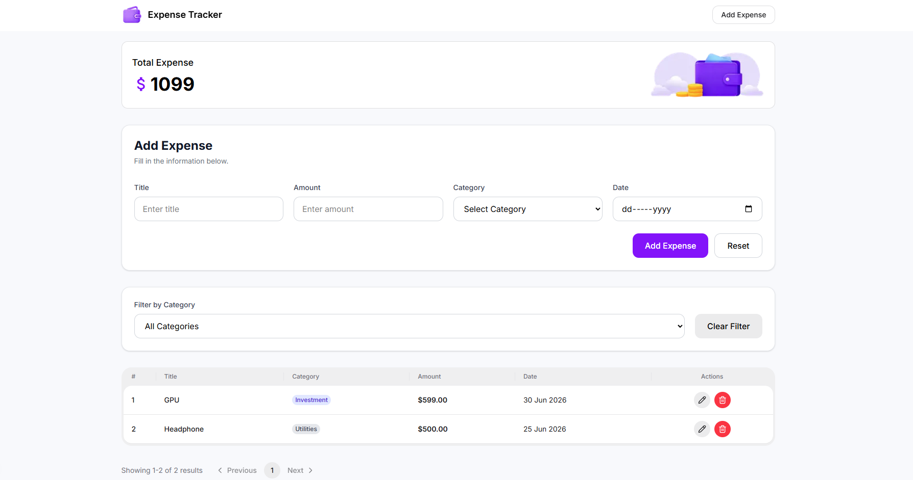

# 💰 Expense Tracker App

A modern and responsive **Expense Tracker** web application built with **Next.js**, **TypeScript**, **HeroUI**, and **Tailwind CSS**. Easily manage your daily expenses by adding, updating, deleting, filtering, and visualizing expense data through an interactive pie chart.

---

## 📸 Preview



---

## 🌐 Live Links

### 🖥️ Client

**Live Demo:** https://expense-tracking-app-by-tawhid.vercel.app

### ⚙️ Server

**API Base URL:** https://expense-tracker-server-ruddy.vercel.app/

---

## 📂 Source Code

### Client Repository

https://github.com/tawhidzihad/expense-tracker-app

### Server Repository

https://github.com/tawhidzihad/expense-tracker-app-server

---

# ✨ Features

- ➕ Add new expenses
- ✏️ Update existing expenses
- 🗑️ Delete expenses with confirmation dialog
- 📊 Expense statistics using Recharts Pie Chart
- 💰 Display total expense amount
- 🏷️ Filter expenses by category
- 📄 Server-side pagination
- 📱 Fully responsive design
- ⚡ Server Actions for API communication
- 📝 Form validation with React Hook Form
- 🎉 Success & error toast notifications
- 🚫 Custom empty states
- ⏳ Custom loading animation
- ❌ Custom 404 page
- ⚠️ Global error page
- 🎨 Clean and modern UI using HeroUI
- 🔄 Automatic UI refresh after CRUD operations

---

# 🛠️ Tech Stack

## Frontend

- Next.js 16
- React 19
- TypeScript
- Tailwind CSS v4
- HeroUI v3

## Backend Communication

- Next.js Server Actions
- Fetch API

## Form Validation

- React Hook Form

## Charts

- Recharts

## Icons

- Lucide React
- React Icons

## Notifications

- React Hot Toast

---

# 📁 Project Structure

```text
src/
│
├── app/
│   ├── error.tsx
│   ├── loading.tsx
│   ├── not-found.tsx
│   ├── layout.tsx
│   └── page.tsx
│
├── components/
│   ├── expenseAddForm/
│   ├── expenseFilter/
│   ├── allExpensesComponents/
│   ├── totalExpenseCard/
│   ├── ExpensePieChart/
│   └── shared/
│
├── lib/
│   ├── api/
│   ├── core/
│   ├── expense-utils.ts
│   └── types.ts
│
└── public/
```

---

# ⚙️ Environment Variables

Create a `.env.local` file in the project root and add the following variable:

```env
NEXT_PUBLIC_BASE_API_URL=https://expense-tracker-server-ruddy.vercel.app
```

---

# 🚀 Getting Started

### Clone the repository

```bash
git clone https://github.com/tawhidzihad/expense-tracker-app.git
```

### Navigate to the project

```bash
cd expense-tracker-app
```

### Install dependencies

```bash
npm install
```

### Configure environment variables

Create a `.env.local` file:

```env
NEXT_PUBLIC_BASE_API_URL=https://expense-tracker-server-ruddy.vercel.app
```

### Run the development server

```bash
npm run dev
```

Visit:

```text
http://localhost:3000
```

---

# 📦 Available Scripts

Start development server

```bash
npm run dev
```

Build for production

```bash
npm run build
```

Start production server

```bash
npm run start
```

Run ESLint

```bash
npm run lint
```

---

# 📱 Responsive Design

The application is fully responsive and optimized for:

- 📱 Mobile
- 📱 Tablet
- 💻 Desktop

---

# 🎯 Future Improvements

- User Authentication
- Expense Search
- Monthly & Yearly Analytics
- Export Expenses (CSV/PDF)
- Multiple Chart Types
- Dark Mode
- Dashboard Overview
- Expense Sorting Options

---

# 👨‍💻 Author

**Md Tawhidul Islam Zihad**

- LinkedIn: https://www.linkedin.com/in/tawhidulislamzihad
